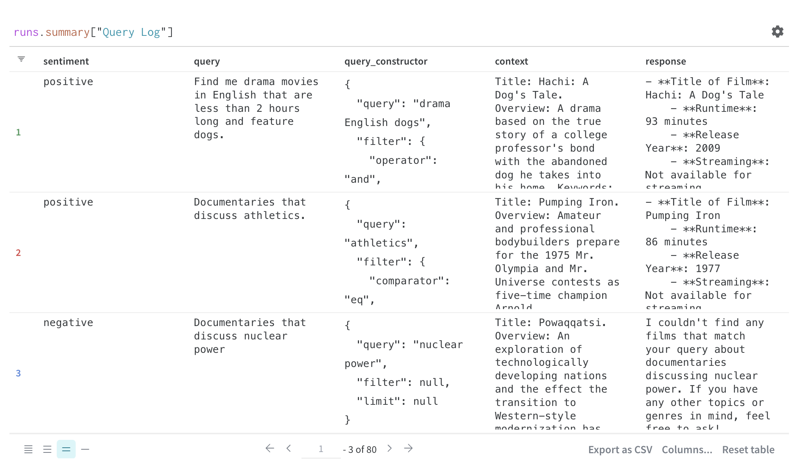
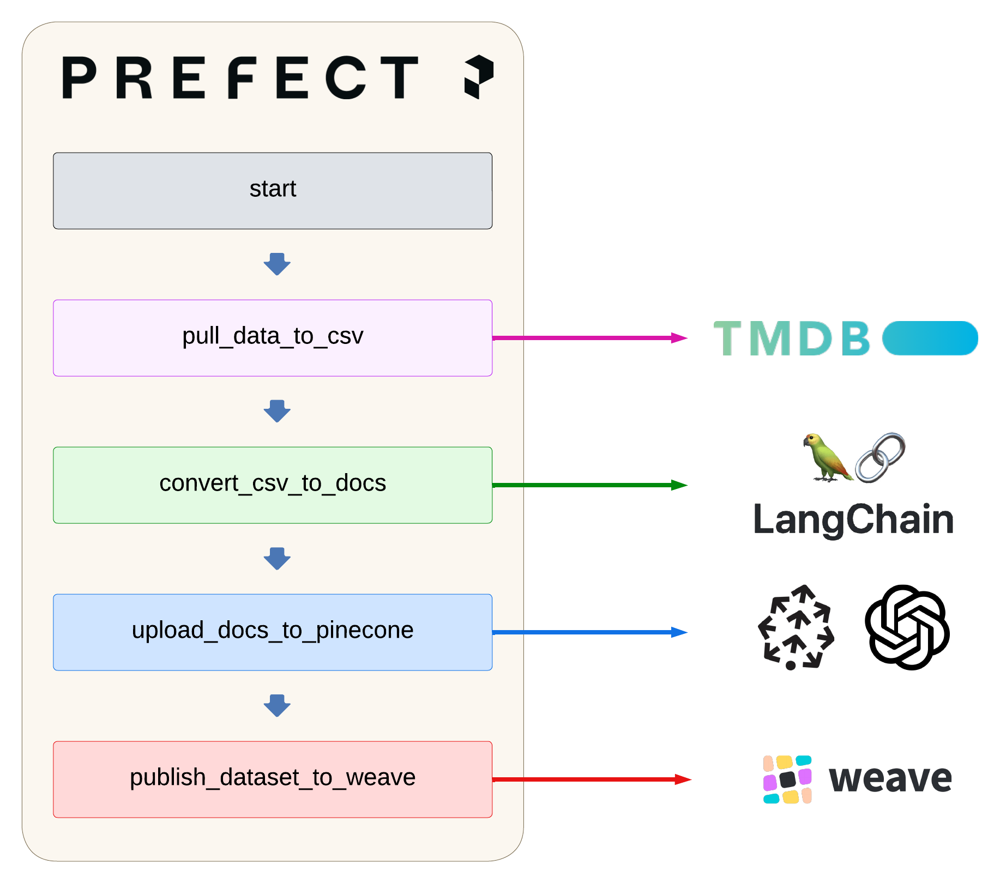

# Rosebud 🌹

### Let's discover films.

Note: If you are interested in web applications with generative AI integration, check out [Los Angeles AI Apps](https://losangelesaiapps.com)🔥.

Try out the app here: [link](https://filmsearch.azurewebsites.net/).

Rosebud is a film recommendation Q&A bot: 

- 🎥 Takes in a user's query and returns appropriate film recommendations. 
- 💬 Goes beyond a basic RAG app. Uses both semantic search across the database as well as metadata filters that are created on the fly using natural language. 
- 🗄️ Uses a Pinecone vector database of roughly the 100 most popular films each year from 1950-2023. **It will only recommend films from this database**. 
- 💯 Incorporates both offline and online evaluation.
- 🙌 Totally open-source and privacy preserving.
- 📕 For more information, please [see my most recent article in *Towards Data Science*](https://towardsdatascience.com/productionizing-a-rag-app-04c857e0966e).
You can also read an [earlier article](https://towardsdatascience.com/how-to-build-a-rag-system-with-a-self-querying-retriever-in-langchain-16b4fa23e9ad) featuring a dev-oriented version of this project.

## Overview of Tools Used 🛠️
- **LangChain**: Framework to create the `rosebud_chat_model`. Important in the creation of the self-querying retriever as well as connecting the OpenAI Chat model to the Pinecone vector store for retrieval augmented generation (RAG).
- **Weights and Biases (W&B)/Weave**: Used for evaluation and reproducibility. W&B and Weave two separate tools unified into a single platform for ease of use. Both offline and online evaluations are stored in W&B/Weave. Offline evaluation is performed using RAGAS (see below). Online evaluation is facilitated via the use of 👍 and 👎 buttons attached to the end of each response. See the image below for an example of the observability:

- **Prefect**: A workflow orchestrator that is used to schedule weekly updates to the data used by the Rosebud chat model (see below).
- **RAGAS**: A popular RAG evaluation framework. For this project, RAGAS was used for offline evaluation. A series of 15-20 questions are each passed to the Rosebud chat model, and the responses are parsed by an LLM judge (`gpt-4o-mini`) for evaluation. There are three metrics that are being tested:
    - `AnswerRelevancy()`: Measures how relevant the answer is to the question being asked. A score from 0 to 1.
    - `ContextRelevancy()`: Measures how relevant the retrieved context is to the question being asked. A score from 0 to 1.
    - `Faithfulness()`: Measures how much the response from the summary model adheres to the retrieved context. A score from 0 to 1. 
    
    These three metrics cover the [RAG triad](https://www.trulens.org/trulens_eval/getting_started/core_concepts/rag_triad/). Check out `offline_eval.py` for the full evaluation code.
- **pytest**: Used for testing. Tests primarily check to make sure that the retrieved data fits the correct format. Check out the `tests/` folder for this code.
- **Pinecone**: The vector store used to hold the documents describing each film. The fact that Pinecone allows for filtering of films via metadata is critical for this app.
- **Streamlit**: Used to create the front-end for the site. Checkout `streamlit_app.py` for this code. 


## Uploading Docs to Pinecone
There are four steps necessary to take data from The Movie Database (TMDB) API and upload them to the Pinecone vector store. Code can be found in the `pinecone_flow.py` file.:



1) **pull_data_to_csv**: Programatically pulls roughly 100 of the top films in each year, from 1950 to today, and creates csv files for each year. Makes use of the [TMDB API](https://developer.themoviedb.org/reference/intro/getting-started). This code pulls the following attributes from each film:

    - **Actors**: e.g. ['Christine Taylor', 'Ben Stiller', ...]
    - **Buy**: e.g. ['Apple TV', 'Amazon Video', ...]
    - **Directors**: e.g. 'Ben Stiller'
    - **Genre**: e.g. 'Comedy'
    - **Keywords**: e.g. 'funny, model, ...'
    - **Language**': e.g. 'English'
    - **Overview**: e.g. 'Film about a male model...'
    - **Production** Companies: e.g. ['Paramount Pictures', 'Village Roadshow Pictures', ...]
    - **Rating**: e.g. 6.2
    - **Release Year**: e.g. 2001
    - **Rent**: e.g. ['Apple TV', 'Amazon Video']
    - **Runtime (minutes)**: e.g. 90
    - **Stream**: e.g. ['Paramount Plus', ...]
    - **Title**: e.g. 'Zoolander'
2) **convert_csv_to_docs**: Uses LangChain to take all of the csv files corresponding to each year and creates [Documents](https://js.langchain.com/v0.1/docs/modules/chains/document/) for each film. Each document has two fields: **page_content** and **metadata**:
    - page_content: The primary content that the LLM will see for each document. In this project, the page_content contains the movie's `title`, `overview`, and `keywords`. When the RAG app performs similarity search between the user query and the documents in the database, it does so over this text.
    - metadata: Attached to each document, this field stores all of the attributes that can be used to filter out documents before similarity search is done. These fields are: `Actors`, `Buy`, `Directors`, `Genre`, `Keywords`, `Language`, `Production`, `Rating`, `Release Year`, `Rent`, `Runtime (minutes)`, `Stream`, and `Title`. 
2) **upload_docs_to_pinecone**: The docs are then embedded using the `text-embedding-3-small` model from OpenAI. The embeddings are then uploaded to the Pinecone vector database programatically.
4) **publish_dataset_to_weave**: Finally, we publish the documents to the Weave platform from Weights & Biases for reproducibility.

## Building the Self-Querying Retriever

The `rosebud_chat_model` class contains six methods:
- `initialize_query_constructor`: Creates the query constructor prompt. This chat model is capable of *self-querying retrieval*. This means that the user's query will be used to filter out documents if necessary. The query constructor prompt dictates what sorts of metadata filtering is possible. It also contains a variety of few-shot examples to help guide the model's behavior. Because we use the Pinecone vector store, the following **comparators** are allowed:
    - `$eq`: Equal to (number, string, boolean)
    - `$ne`: Not equal to (number, string, boolean)
    - `$gt`: Greater than (number)
    - `$gte`: Greater than or equal to (number)
    - `$lt`: Less than (number)
    - `$lte`: Less than or equal to (number)
    - `$in`: In array (string or number)
    - `$nin`: Not in array (string or number)

    The following **operators** are allowed:
    - `AND`
    - `OR`

    Currently, the `gpt-4o-mini` model is used to take the user's query and convert it into simplified query with attached metadata filter. For example, the input `Find me drama movies in English that are less than 2 hours long and feature dogs.` creates the following query: 

    ```
    {
        "query": "drama English dogs", 
        "filter": {
            "operator": "and", 
            "arguments": [
                {
                    "comparator": "eq", "attribute": "Genre", "value": "Drama"
                }, 
                {
                    "comparator": "eq", "attribute": "Language", "value": "English"
                }, 
                    
                {
                    "comparator": "lt", "attribute": "Runtime (minutes)", "value": 120
                }
            ]
        },
    }
    ```
- `initialize_vector_store`: Connects the chat bot to the Pinecone vectorstore containing all of the documents. Recall earlier that we used a Prefect flow to create and push the documents to Pinecone.  
- `initialize_retriever`: Creates the self-querying retriever, which incorporates the query constructor, choice of LLM (`gpt-4o-mini`), and the Pinecone vectorstore. 
- `initialize_chat_model`: Creates the summary model, which uses `gpt-4o-mini` to take in the retrieved film documents from Pinecone and crafts recommendations to answer the user's query. There is a basic template provided here so that the bot creates structured output. 
- `predict_stream`: The method used to stream predictions to the Streamlit front-end. Chunks are streamed from the model one at a time. 
- `predict`: The method used to perform offline evaluation using the RAGAS framework. Inputs and outputs to this function are tracked using Weave. The output here is not streamed, and is performed asynchronously to facilitate fast off-line evaluation.
